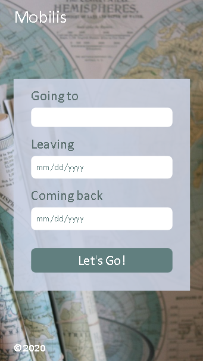
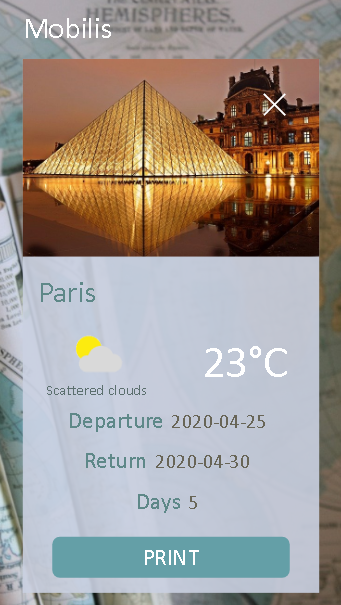

# WeatherProject
 Mobilis weather app

## Table of contents
* [General info](#general-info)
* [Technologies](#technologies)
* [TODO](#to-do)
* [Screenshots](#screenshots)

## General info
Travel planning app created for Frontend Nanodegree capstone project.

## Technologies
* Express 4.17.1
* Node.js 12.13.1
* [GeoNames API](http://www.geonames.org/export/ "GeoNames API")
* [Weather API](https://www.weatherbit.io/api "Weather API")

##TODO
- add more functionality
- use Local Storage
- blueprint for db based app
- use alternative to deprecated request pkg

## Screenshots
Form Card             |  Travel Card
:-------------------------:|:-------------------------:
  |  
